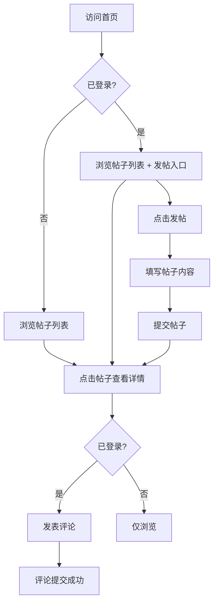

## 1. 产品概述

一个轻量级Web论坛应用，支持用户注册登录、发帖、浏览帖子、评论互动等核心功能。面向需要快速搭建社区讨论场景的用户群体，提供简洁高效的交流平台。

- 解决小型社区或团队内部的信息共享与讨论需求
- 目标用户：小型社区成员、兴趣小组、团队内部交流

## 2. 核心功能

### 2.1 用户角色

| 角色 | 注册方式 | 核心权限 |
|------|----------|----------|
| 普通用户 | 用户名+密码注册 | 浏览帖子、发帖、评论 |
| 游客 | 无需注册 | 浏览帖子 |

### 2.2 功能模块

1. **首页**：帖子列表、分类筛选、搜索、导航栏
2. **帖子详情页**：帖子内容、评论区、发表评论
3. **发帖页**：标题、内容编辑、分类选择
4. **登录/注册页**：用户认证

### 2.3 页面详情

| 页面名称 | 模块名称 | 功能描述 |
|----------|----------|----------|
| 首页 | 导航栏 | Logo、搜索框、登录/注册按钮、发帖按钮 |
| 首页 | 帖子列表 | 按时间/热度排序的帖子卡片，显示标题、作者、时间、评论数 |
| 首页 | 分类筛选 | 按分类过滤帖子 |
| 帖子详情页 | 帖子内容 | 完整帖子标题、作者信息、发布时间、正文内容 |
| 帖子详情页 | 评论区 | 评论列表、评论输入框、提交评论 |
| 发帖页 | 发帖表单 | 标题输入、内容编辑（支持Markdown）、分类选择、提交 |
| 登录页 | 登录表单 | 用户名、密码输入、登录按钮、跳转注册 |
| 注册页 | 注册表单 | 用户名、密码、确认密码、注册按钮、跳转登录 |

## 3. 核心流程

用户浏览帖子流程：访问首页 → 浏览帖子列表 → 点击帖子 → 查看详情与评论

用户发帖流程：登录 → 点击发帖 → 填写标题/内容/分类 → 提交 → 跳转至帖子详情

用户评论流程：登录 → 查看帖子详情 → 输入评论 → 提交评论 → 评论出现在列表

## 4. 用户界面设计

### 4.1 设计风格

- 主色调：深墨绿色 (#1a2f23) + 暖金色点缀 (#d4a853)
- 辅助色：米白色背景 (#f5f0e8)、深灰色文字 (#2d2d2d)
- 按钮风格：圆角微凸起，主按钮墨绿色底白字，次要按钮描边风格
- 字体：标题使用 Noto Serif SC（衬线体），正文使用 Noto Sans SC
- 布局风格：卡片式布局，顶部导航栏，居中内容区域
- 图标风格：线性图标，与文字搭配使用

### 4.2 页面设计概览

| 页面名称 | 模块名称 | UI元素 |
|----------|----------|--------|
| 首页 | 导航栏 | 墨绿色背景，Logo左侧，搜索框居中，按钮右侧，微阴影 |
| 首页 | 帖子列表 | 白色卡片，左侧标题+摘要，右侧作者头像+时间，悬浮微上浮动画 |
| 首页 | 分类筛选 | 横向标签式，选中态墨绿色底白字 |
| 帖子详情页 | 帖子内容 | 大标题、作者信息行、分割线、正文区域，背景微纹理 |
| 帖子详情页 | 评论区 | 评论卡片列表，每条评论含头像、用户名、时间、内容，底部输入框 |
| 发帖页 | 发帖表单 | 居中表单卡片，输入框带聚焦动画，分类下拉选择，提交按钮 |
| 登录/注册页 | 认证表单 | 居中卡片式表单，背景渐变，输入框带图标 |

### 4.3 响应式设计

- 桌面优先设计，最大内容宽度 960px 居中
- 平板适配：内容区域自适应宽度
- 移动端适配：导航栏折叠为汉堡菜单，卡片单列布局
