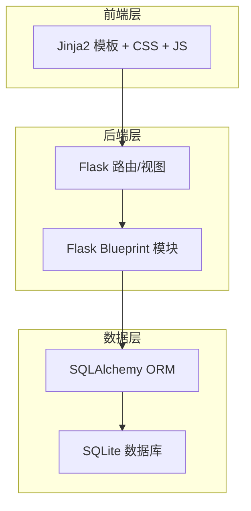
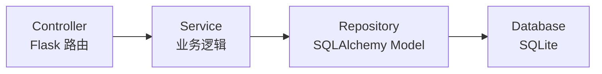
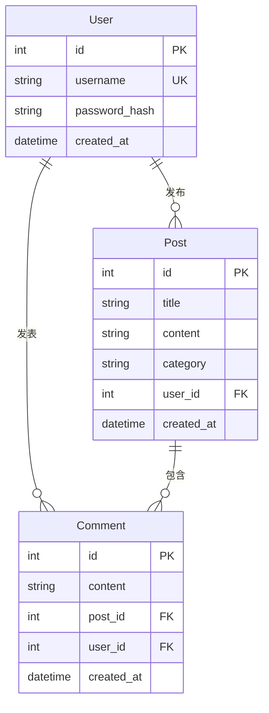

## 1. 架构设计



## 2. 技术说明

- 前端：Jinja2 模板引擎 + 自定义 CSS + 原生 JavaScript
- 后端：Python Flask 框架
- 数据库：SQLite + Flask-SQLAlchemy ORM
- 认证：Flask-Login（用户会话管理）
- 密码加密：Werkzeug security（密码哈希）
- 初始化工具：手动创建项目结构

## 3. 路由定义

| 路由 | 方法 | 用途 |
|------|------|------|
| `/` | GET | 首页，显示帖子列表 |
| `/category/<name>` | GET | 按分类筛选帖子 |
| `/search` | GET | 搜索帖子 |
| `/post/<id>` | GET | 帖子详情页 |
| `/post/new` | GET/POST | 发帖页面/提交帖子 |
| `/post/<id>/comment` | POST | 提交评论 |
| `/auth/login` | GET/POST | 登录页面/登录 |
| `/auth/register` | GET/POST | 注册页面/注册 |
| `/auth/logout` | POST | 退出登录 |

## 4. API 定义

### 4.1 认证相关

```python
# 登录
POST /auth/login
Request: { username: str, password: str }
Response: 重定向至首页 / 返回登录页+错误信息

# 注册
POST /auth/register
Request: { username: str, password: str, confirm_password: str }
Response: 重定向至登录页 / 返回注册页+错误信息

# 退出
POST /auth/logout
Response: 重定向至首页
```

### 4.2 帖子相关

```python
# 发帖
POST /post/new
Request: { title: str, content: str, category: str }
Response: 重定向至帖子详情页 / 返回发帖页+错误信息

# 评论
POST /post/<id>/comment
Request: { content: str }
Response: 重定向至帖子详情页
```

## 5. 服务器架构图



## 6. 数据模型

### 6.1 数据模型定义



### 6.2 数据定义语言

```sql
CREATE TABLE user (
    id INTEGER PRIMARY KEY AUTOINCREMENT,
    username VARCHAR(80) UNIQUE NOT NULL,
    password_hash VARCHAR(256) NOT NULL,
    created_at DATETIME DEFAULT CURRENT_TIMESTAMP
);

CREATE TABLE post (
    id INTEGER PRIMARY KEY AUTOINCREMENT,
    title VARCHAR(200) NOT NULL,
    content TEXT NOT NULL,
    category VARCHAR(50) DEFAULT '综合',
    user_id INTEGER NOT NULL,
    created_at DATETIME DEFAULT CURRENT_TIMESTAMP,
    FOREIGN KEY (user_id) REFERENCES user(id)
);

CREATE TABLE comment (
    id INTEGER PRIMARY KEY AUTOINCREMENT,
    content TEXT NOT NULL,
    post_id INTEGER NOT NULL,
    user_id INTEGER NOT NULL,
    created_at DATETIME DEFAULT CURRENT_TIMESTAMP,
    FOREIGN KEY (post_id) REFERENCES post(id),
    FOREIGN KEY (user_id) REFERENCES user(id)
);

CREATE INDEX idx_post_category ON post(category);
CREATE INDEX idx_post_created ON post(created_at DESC);
CREATE INDEX idx_comment_post ON comment(post_id);
CREATE INDEX idx_comment_created ON comment(created_at DESC);
```
